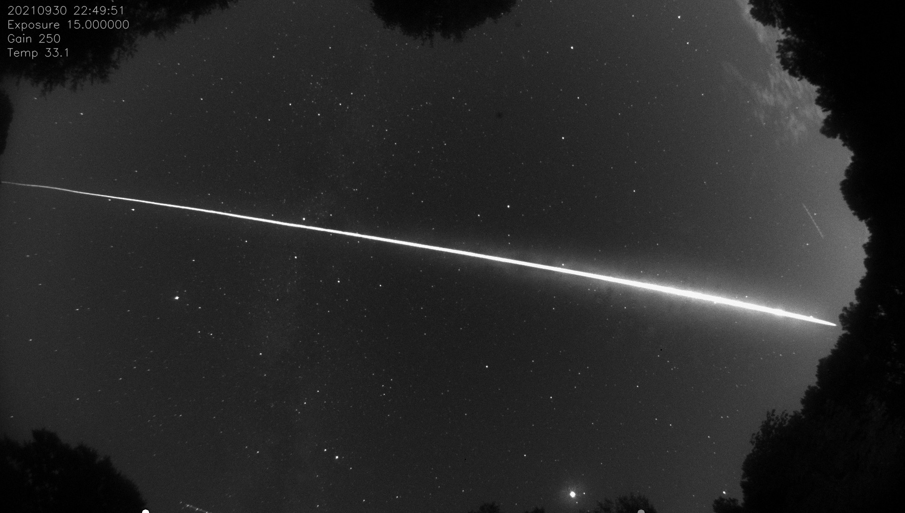
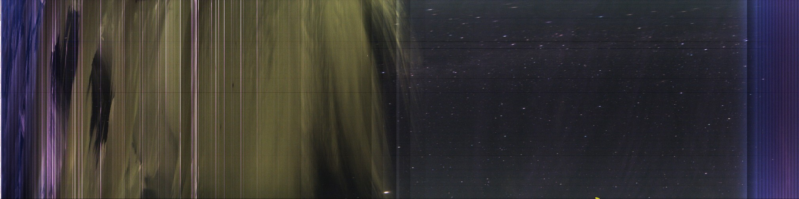
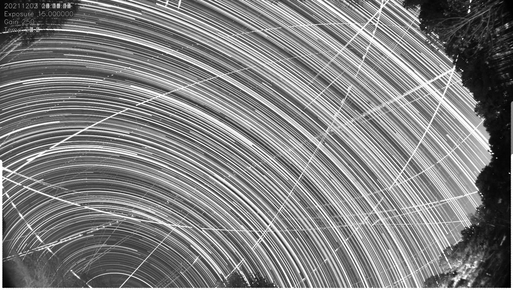
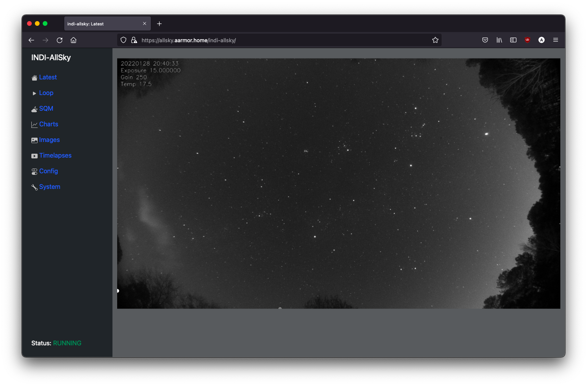
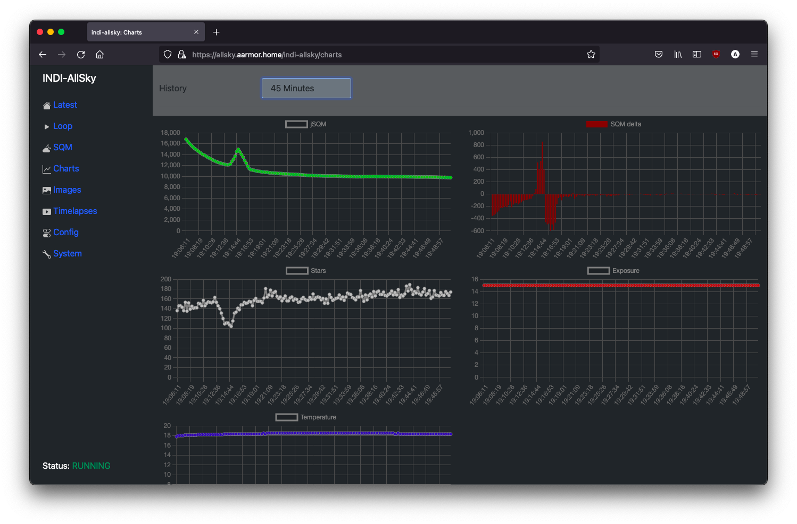
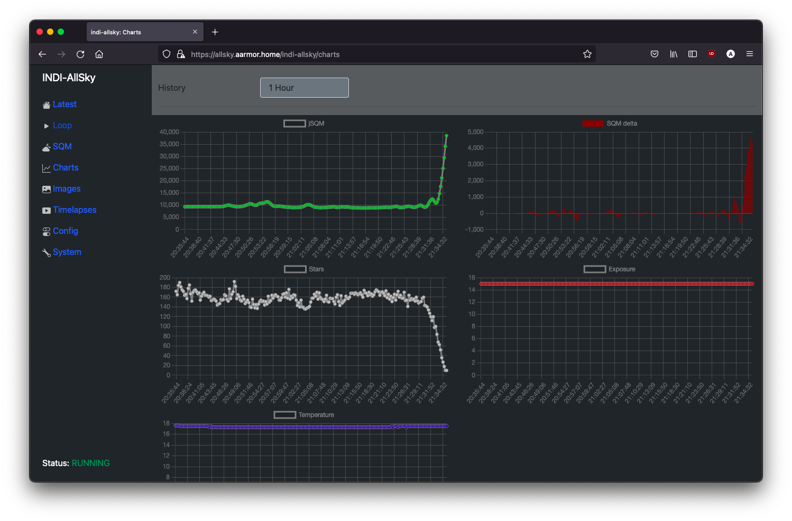
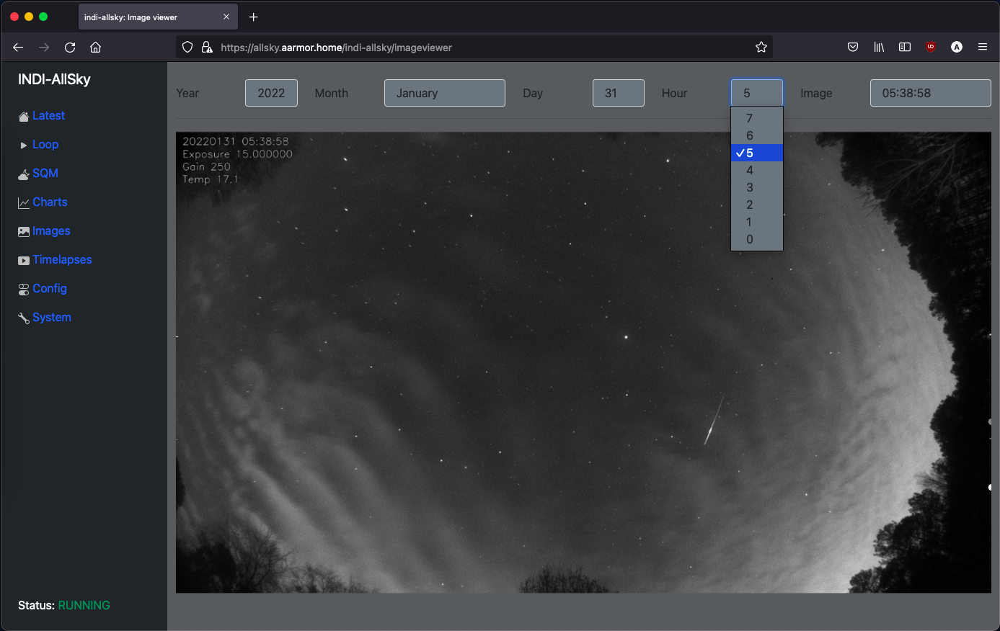
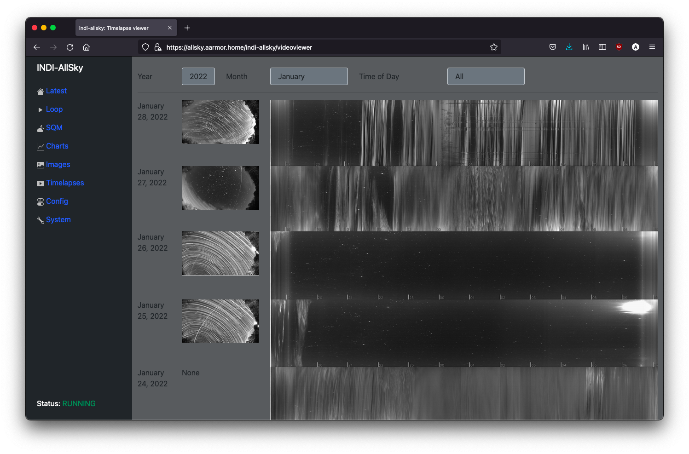
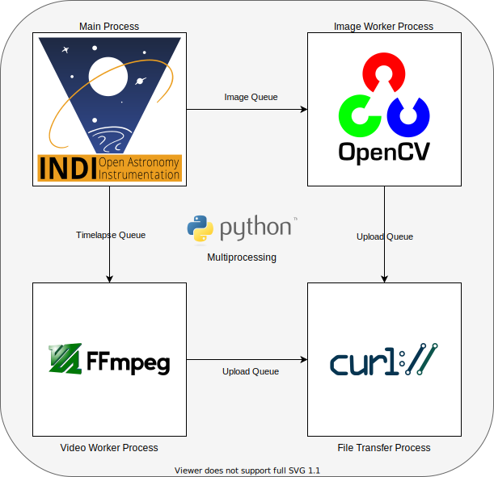

# indi-allsky
indi-allsky is software used to manage a Linux-based All Sky Camera using the INDI framework.  Theoretically, any INDI supported CCD/CMOS camera can be functional.

*Pictured: SpaceX Cargo Dragon (over Georgia) headed for splashdown off the coast of Florida*

## New Features
* Real-Time Keogram
    * A keogram is generated in realtime with every image that is taken
* Long Term Keogram
    * Automates the generation of Keograms that could span months or years
* Moon Overlay
    * Realtime accurate representation of illumination of the moon
* Satellite Tracking
* ADS-B Aircraft Tracking
    * Use a SDR to tag aircraft that appear in your camera
* Mini-Timelapses
    * Create videos of specific events captured with your camera
* Weather API
    * OpenWeather Map API
    * Weather Underground API
    * Astrospheric API
    * Ambient Weather API
    * Ecowitt API
* Native Fan controller support
    * Standard
    * PWM Controlled
* Native Dew Heater support
    * Standard
    * PWM Controlled
* Native Temperature Sensor support
    * DS18B20 1-wire
    * DHT11/22
    * BMP180
    * BME280 (i2c & SPI)
    * BME680 (i2c & SPI)
    * BMP3xx (i2c & SPI)
    * Si7021
    * SHT3x
    * SHT40/41/45
    * HTU21D
    * HTU31D
    * AHT10/20
    * HDC302x
    * LM35 via ADS1x15 ADC
    * TMP36 via ADS1x15 ADC
    * MLX90614 Sky Temperature
    * MLX90640 Thermal Camera
    * SCD-30
    * SCD-40/41
* Light (Lux) Sensors
    * TSL2561
    * TSL2591
    * VEML7700
    * BH1750
    * SI1145
    * LTR390
* Generic GPIO controls
* MQTT Broker sensors
    * Subscribe to topics as sensor input
* Mechanical focuser support
    * 28BYJ-48 Stepper
    * A4988 with NEMA17 Stepper
* Use star metrics (in addition to ADU) for star trails generation
* Generate thumbnails to reduce load time in Timelapse view
* Panorama timelapse generation
* Fish-eye to Panoramic perspective
* Upload timelapse videos directly to YouTube
* Cardinal direction labels
* Satellite tracking and visibility info
* Wildfire smoke reporting *(North America only)*
* Aurora prediction and Kp-index reporting

## Features
* RAW data is the default and preferred input
    * INDI - 16-bit FITS data
    * libcamera - 16-bit DNG data
    * Also supports 8-bit RGB (RGB24), PNG, and JPEG input
* Multiple camera vendor support
    * ZWO
    * Svbony
    * QHY
    * Altair
    * ToupTek
    * Starlight Xpress
    * Player One Astronomy
    * Raspberry Pi Camera Modules
        * HQ Camera (IMX477)
        * IMX378
        * Camera Module v3 (IMX708)
        * AI Camera (IMX500)
        * IMX678 Darksee
        * IMX283 Klarity/OneInchEye
        * IMX519
        * IMX462
        * IMX327
        * 64mp HawkEye (IMX682)
        * 64mp OwlSight (OV64A40)
        * other libcamera supported modules
    * DSLRs
    * Generic web cameras
    * More to come
* Image stretching (16-bit)
    * Standard Deviation Cutoff (Original)
    * Midtone Transfer Function
* Multi-image stacking
* Dark calibration frames to remove hot pixels
* Camera temperature control (for cameras with active cooling)
* Timelapse video generation
* GPS support
* Images tagged with EXIF data (JPEG only)
* TrueType font support for image labels
* Remote web portal
* Network file transfers - Upload images and videos to remote site
    * S3 Object Storage support
        * Amazon Web Services
        * Google Cloud Storage
        * Oracle OCI Storage
* Publish data to an MQTT service for monitoring
    * Home Assistant Auto-Discovery integration
* Keograms
* Star Trails
* Automatic meteor/plane/satellite detection
* Docker containerization support
* Images display local hour angle of sun and moon
* Moon mode - reduced gain when the moon is overhead
* Remote INDI server operation - operate camera remotely over the network
* Pseudo-Sky Quality Meter - Use your all sky camera to measure sky brightness/quality
* Relational database stores image and timelapse information
    * SQLite (default)
    * MySQL/MariaDB

## Frequently Asked Questions

https://github.com/aaronwmorris/indi-allsky/wiki/FAQ

## Requirements
* A computer running a modern Linux distribution, such as a Raspberry Pi
    * Multicore is recommended
        * ARM
        * x86_64
    * 2GB RAM recommended, 1GB minimum
        * 512MB is adequate for image acquisition, but not enough to generate timelapse videos with ffmpeg
    * 64GB of storage minimum to store 2 months of videos and 30 days of JPEG images.
    * (Optional) Internet connectivity for image uploading
* Camera
    * Most INDI supported astro/planetary cameras will work
    * [libcamera](https://github.com/aaronwmorris/indi-allsky/wiki/libcamera-enablement) - Raspberry Pi camera module

## Distibution support
| Distribution                   | Arch           | Note |
| ------------------------------ | -------------- | ---- |
| **Raspberry Pi OS 12 (bookworm)**  | **aarch64 (64-bit)** | **RECOMMENDED** Compile INDI with build_indi.sh Use libcamera or [indi_pylibcamera](https://github.com/scriptorron/indi_pylibcamera) for Raspberry PI HQ camera |
| Raspberry Pi OS 12             | armhf (32-bit) | (NOT RECOMMENDED) Some python modules do not have armhf wheels and must be compiled from source.  This will take a few hours. |
| Raspberry Pi OS 11 (bullseye)  | aarch64/armhf  | Compile INDI with build_indi.sh |
| Raspberry Pi OS 10 (buster)    | armhf          | (DO NOT USE) |
| **Debian 12 (bookworm)**       | **x86_64**     | **RECOMMENDED** Compile INDI with build_indi.sh |
| Debian 11 (bullseye)           | x86_64         | Compile INDI with build_indi.sh |
| Debian 10 (buster)             | x86_64         | (DO NOT USE) |
| Ubuntu 24.04 (noble)           |                | Requires INDI 2.0.8 or newer for pyindi-client INDI installed from ppa:mutlaqja/ppa Compile libcamera with build_libcamera.sh |
| Ubuntu 22.04 (focal)           | aarch64        | INDI installed from ppa:mutlaqja/ppa |
| Ubuntu 22.04                   | armhf          | Compile INDI with build_indi.sh |
| Ubuntu 22.04                   | x86_64         | INDI installed from ppa:mutlaqja/ppa |
| Ubuntu 20.04 (bionic)          | x86_64         | (NOT RECOMMENDED) INDI installed from ppa:mutlaqja/ppa |
| Ubuntu 20.04                   | aarch64        | (NOT RECOMMENDED) Compile INDI with build_indi.sh |
| Armbian                        | aarch64/armhf  | Compile INDI with build_indi.sh https://github.com/aaronwmorris/indi-allsky/wiki/Armbian-Tuning |
| Stellarmate 1.8.x              | x86_64/aarch64 | INDI pre-installed |
| ~~Astroberry Server 2.0~~      | armhf          | (DO NOT USE) The Astroberry appears to be abandoned and is no longer supported with indi-allsky |

## INDI support
| Version         | Note |
| --------------- | ---- |
| v2.1.2          |      |
| v2.1.1          | **Recommended** |
| v2.1.0          |      |
| v2.0.9          |      |
| v2.0.8          | Minimum for Ubuntu 24.04 (pyindi-client) |
| v2.0.7          | Minimum for ASI676MC |
| v2.0.6          |      |
| v2.0.5          | Requires upgrade to indi-allsky v7.7 [ZWO ASI problem](https://github.com/aaronwmorris/indi-allsky/wiki/INDI-2.0.5-notes) |
| v2.0.4          | [Typo in indibash.h prevents building pyindi-client](https://github.com/aaronwmorris/indi-allsky/wiki/INDI-2.0.4-bug) Svbony support is broken |
| v2.0.3          |      |
| v2.0.2          |      |
| v2.0.1          |      |

## Single Board Computer support
| Board                         | Note |
| ----------------------------- | ---- |
| Raspberry Pi 5                | Requires bookworm (12) |
| Raspberry Pi 4                | Recommend 64-bit bookworm (12) |
| Raspberry Pi 3                | Recommend 64-bit bookworm (12), recommend 1GB of swap |
| Raspberry Pi Zero 2           | Recommend 64-bit bookworm (12), memory constrained |
| Raspberry Pi Zero             | Recommend 32-bit bullseye, memory constrained |
| Rock Pi                       |      |
| Libre Computer (Le Potato)    |      |
| Orange Pi                     |      |
| Orange Pi PC Plus             | Requires 2GB swap (and patience) to build all python modules |
| Banana Pi                     |      |
| BeagleBone                    |      |

## Memory Requirements for Timelapses
Memory requirements are primarily driven by the resolution of the timelapse generated by the FFMPEG utility.  A higher resolution camera can be used on lower memory system by scaling the output resolution of the FFMPEG process.

| Output Resolution  | Recommended Memory | Minimum Memory        | FFMPEG Process Memory |
| ------------------ | ------------------ | --------------------- | --------------------- |
| 852 x 480 (0.4MP)  | 1GB                | <1GB with swap        | 0.2GB                 |
| 1280 x 960 (1.2MP) | 2GB                | 1GB with 1GB swap     | 0.4GB                 |
| 1920 x 1080 (2MP)  | 2GB                | 1GB with 1GB swap     | 0.6GB                 |
| 3840 x 2160 (8MP)  | 4GB                | 2GB with 1GB swap     | 1.7GB                 |
| 3008 x 3008 (9MP)  | 4GB                | 2GB with 1GB swap     | 1.8GB                 |
| 4056 x 3040 (12MP) | 4GB                |                       | 2.5GB                 |
| 6224 x 4168 (26MP) | 8GB                |                       | 5.0GB                 |
| 9152 x 6944 (64MP) | 16GB               |                       | 12.0GB                |

# Installation
The process for installing indi-allsky is documented in the wiki.

https://github.com/aaronwmorris/indi-allsky/wiki/Getting-Started

### Docker Containerization
indi-allsky has full support for running in a containerized environment.  Check out the `docker/` folder for the Docker assets.

https://github.com/aaronwmorris/indi-allsky/wiki/Docker

### Logs
* When indi-allsky is run from the command line, logs are sent to STDERR by default.
* When the indi-allsky service is started, logs are sent to syslog via facility local6.  Logs are stored in `/var/log/indi-allsky/indi-allsky.log` and rotated daily.
    * Web interface logs are located at `/var/log/indi-allsky/webapp-indi-allsky.log`

## Updating
indi-allsky updates are designed to be rolling releases.  I do everything I can to prevent breaking changes.  Most changes only require pulling updates from GitHub and re-running setup.sh.

https://github.com/aaronwmorris/indi-allsky/wiki/Updating-indi-allsky

### Security
In an effort to increase security, I am trying to do a better job of tracking security issues in indi-allsky and the associated Software Bill of Materials.  GitHub Dependabot alerts are enabled which help track things like vulnerable Python modules.

https://github.com/aaronwmorris/indi-allsky/wiki/Security-considerations

https://github.com/aaronwmorris/indi-allsky/wiki/Security-Notifications

### libcamera support
libcamera is a new camera interface designed to replace the legacy camera interfaces such as V4L2.

Proper libcamera support is only working on Raspberry Pi OS 11 (bullseye) on Raspberry Pi 3 & 4.

https://github.com/aaronwmorris/indi-allsky/wiki/libcamera-enablement

*Note: Genererating and processing raw (dng) files on a system with less than 1GB of memory and libcamera will cause out-of-memory conditions.  There is an option to generate JPEG or PNG files with libcamera which solves this issue.*

### Dark frames
indi-allsky fully automates the capture and processing of master dark calibration frames. Currently, sigma clipping and average methods are supported.

https://github.com/aaronwmorris/indi-allsky/wiki/Dark-Calibration-Frames

### Moon mode

This is a special night time operating mode intended to reduce gain when the moon is more illuminated and above the horizon

## Keograms
Keograms are a visual representation of the entire timelapse video in a single frame.  Every image is rotated so that the vertical aligns to the meridian and then the center-vertical column is extraced from each frame and compiled into the keogram.  The rotation parameter in the config is KEOGRAM_ANGLE

https://github.com/aaronwmorris/indi-allsky/wiki/Keogram-Rotation

Below you can see perodic clouds passed over between 8-9pm and again between 4-5am.  If you look closely enough, you can see the Pleiades star cluster and the Orion constellation as it passed through the meridian in this example keogram.

*Note: The horizontal lines are just hot pixels that were subtracted by the dark frame.*

## Star Trails
Star trail images stack the stars from each frame to show their progression across the sky.

### Star Trails Timelapse
Video of the star trails being stacked in real-time!

[YouTube](https://youtu.be/pLJbTzlyBkM)

## Smoke reporting
indi-allsky polls data from [NOAA Office of Satellite And Product Operations](https://www.ospo.noaa.gov/) to report the level of smoke coverage in your location.  The OSPO provides KML map data for their [Hazard Mapping System Fire and Smoke Product](https://www.ospo.noaa.gov/Products/land/hms.html) [HMS].  indi-allsky processes the smoke polygons in the KML map data and checks if your location (~35 mile radius) is contained within the smoke areas.

Smoke data is updated every 3 hours from NOAA.  Smoke data is also published with the MQTT data.

*Note: Data is only available for **North America**.*

## Aurora, Kp-index, and Solar Wind
indi-allsky utilizes data from [NOAA Space Weather Prediction Center](https://www.swpc.noaa.gov/) to predict the possibility of Aurora in your location.  The SWPC provides data using the Ovation Aurora Model for aurora predictions.  indi-allsky uses the Ovation data to create an aggregate score within a ~500 mile radius around your location.

The current Kp-index value is also polled from NOAA.  This is the measurement of the disturbance of the Earth's magnetic field, ranging from 0-9.  Values higher than 5 are good indicators of stronger solor storm activity which creates aurora.

The Kp-index data, combined with the Ovation data, gives an objective prediction of the visibility of Aurora for your location.

Also available are Magnetic field Bt, Bz, Hemispheric power, and Solar Wind speed and density data.

Aurora data is updated every 60 minutes from NOAA.  Aurora data is also published with the MQTT data.

## Satellite Tracking
Satellite tracking data is used to track the visibility of specific satellites like the International Space Station and Hubble Space Telesope.  Rise, transit, and set times are available in the Astropanel view.

Orbital data is downloaded in TLE format from [CelesTrak](https://celestrak.org/NORAD/elements/)

## Star Detection
indi-allsky utilizes OpenCV pattern matching to detect and count the number of stars in the view.  Star counts are a good objective measurement of sky conditions.

Star and meteor detection support using detection masks to customize your Region of Interest if there are obstructions in your view.
https://github.com/aaronwmorris/indi-allsky/wiki/Detection-Masks

## Meteor Detection
Using OpenCV Canny edge detection and Hough Line Transform, indi-allsky is able to perform basic line detection to detect meteor and fireball trails in the view.  Airplane and satellite trails are also detected using this method.  Images are tagged with an asterisk in the image viewer if a trail has been detected.

## Focus Mode
Focus mode is a special setting that generates images more often and implements a Variance of Laplacian scoring algorithm on the image to assist with focusing the camera.  Images are not saved when focus mode is enabled.

## Stacking
indi-allsky supports image stacking to increase details and contrast in the image.

The following stacking modes are provided:
* Maximum - The maximum value of each pixel in the stack is used.  Increases contrast of stars and sky overall.  Extends the effect of satellite/airplane trails, meteors, and other phenomena.
* Average - The average value of each pixel is used in the resulting image.
* Minimum - The minimum value of each pixel is used.  This has the effect of removing airplane and satellite trails (and meteors).

The `Stack split screen` option will split the image into two panes.  The left pane will show the original image data and the right pane will contain the stacked data.

Regarding performance, stacking does have an impact to memory and CPU utilization.  indi-allsky stores the RAW images used for the stack in memory.  A single 1920x1080 (1K) image is approximately 8MB.  Four 1K images will require 32MB of memory.  A single 4056x3040 (4K) RAW image is ~25MB, four would require 100MB of memory (at all times).

CPU utilization and memory is reasonable for stacking 1K images on Raspberry Pi 3 (1GB) hardware, but 4K stacking starts to significantly impact response times.  Strongly recommend Raspberry Pi 4 with 2+GB of memory for 4K images.

Registration (alignment) requires significantly more CPU time and doubles the memory requirement since the registered images must also be stored in memory.  Registering one 1920x1080 (1K) image (reference + image) requires 2-3 seconds on Raspberry Pi 3 hardware.

## Web Interface

The indi-allsky web interface is built on the Flask MVC framework.  It is designed to be a dashboard for your sky.  Included is the ability to fully manage the camera configuration without having to manually edit from the command line.

Most views do not require authentication.  Credentials for accessing the privileged areas are defined upon the first setup of the software.

### Home Page

### Charts
Early evening, the sun was still going down, but a cloud passed by, increasing the average brightness and lowering the star count.

A large cloud passed over significantly increasing the brightness of the sky and blocking out almost all of the stars.

### Image viewer
Historical images browsing.

*Pictured: A small satellite flare.*

### Timelapse viewer
Historical Star trails and Keograms.  The Keogram image is linked directly to the timelapse video for the night.

### System Info

## Database

All media generated are logged in a local SQLite database stored in /var/lib/indi-allsky/indi-allsky.sqlite  This database is used as the source of images for timelapse and keogram generation, as well as, for displaying images via the web interfaces.

The database is managed via the python modules SQLAlchemy and alembic to provide migrations (schema upgrades) automatically in the setup.sh script.

## Remote Web Portal - SyncAPI

An on-premises indi-allsky system can synchronize images and timelapses to a cloud-based indi-allsky web server instance using the built in SyncAPI.  Remote users can browse the remote indi-allsky web instance without touching the system running the camera.  Images are synced in real-time.

In effect, the indi-allsky web interface is its own remote web portal.

A remote indi-allsky instance can support multiple clients using SyncAPI with a single instance.  Users can easily switch between the cameras in the web interface.  The SyncAPI can also be combined with the S3 Object Storage functionality to offload image storage to a cloud service.

### Home Hosting

The indi-allsky web interface is designed to be directly exposed to the Internet, if you have sufficient bandwidth on your home Internet connection.  A simple, yet effective, access control system is implemented to let anonymous (or authenticated) users safely browse images and videos without exposing privileged controls.  Only users with assigned administrative authority can make changes.

https://github.com/aaronwmorris/indi-allsky/wiki/Security-considerations

It is also possible to use cloud security offerings like [Cloudflare Tunnel](https://www.cloudflare.com/products/tunnel/) to further protect your indi-allsky site.

## Sensor support

indi-allsky supports reading sensors natively on single board computers like Raspberry Pi.

https://github.com/aaronwmorris/indi-allsky/wiki/Sensors

## Dew Heater support

Native dew heater support is built in for standard and PWM controlled dew heaters.

https://github.com/aaronwmorris/indi-allsky/wiki/Dew-Heater-Support

## Fan Controller support

Native fan controller support is built in for standard and PWM controlled fans.

https://github.com/aaronwmorris/indi-allsky/wiki/Fan-Control

## Focuser support

If you built your system with a focuser, it is now possible to control the focuser within the Focus view.  `28BYJ-48` and `NEMA17` steppers are currently supported.

https://github.com/aaronwmorris/indi-allsky/wiki/Focuser-Device

## YouTube support
indi-allsky supports being able to upload timlapse and star trail videos directly to YouTube

https://github.com/aaronwmorris/indi-allsky/wiki/Youtube-Uploads

## S3 Object Storage

You may choose to upload images and timelapse files to an S3 bucket.  Once the images are in the bucket, images and videos in the web interface will be loaded directly from S3 instead of the local indi-allsky web server.  You could easy host the web interface from your home internet connection and just have the large media files served from S3.

Currently, only Amazon Web Services is supported, but other providers could be easily be added.  Just open an issue.

Estimated cost for an allsky camera holding 90 days of timelapses and 30 days of images on AWS (day and night):  ~$2.00 (USD) per month  (50GB of data + 180,000 requests)

AWS S3 and GCP Storage are currently supported.

*Note:  As of writing this, the AWS free tier for S3 supports 5GB and 2000 requests per month.  In a single night, I achieved 80% of the requests limit (8 hours of images every 15 seconds is 1920 upload requests).  The free tier is only sufficient for basic testing, but not long term usage.*

## GPS

GPS support is provided through [indi_gpsd](https://www.indilib.org/aux/gps.html) and GPSd integration.  Any GPS hardware supported by GPSd will work.

JPEG and FITS Images exported [optional] by indi-allsky will be properly tagged with Geographic (latitude/longitude) and Astrometric (RA/dec) information in the headers.  Tags include geographic location regardless of GPS support, but the information will be much more precise with the GPS module.

## Performance

indi-allsky itself is written in python, but python is just the glue between the different libraries, most of which are C based which makes indi-allsky extremely fast.  A 1920 x 1080 image can be dark frame calibrated, debayered, histogram processed, text applied, and compressed to a JPG in less than 0.5 seconds on Raspberry Pi 3 class hardware.  PNG processing is a little more taxing, but usually only takes a few seconds.

ffmpeg video processing is considerably more expensive.  A 2 minute 1920x1080 h.264 encoded video compiled from 3,000 frames requires ~20 minutes on Raspberry Pi 3 (4 core) hardware.  Encoding takes place in a separate process from image aqcuisition and image processing and is run at the lowest CPU priority so image acquision is not impacted.

## Software Dependencies

| Function          | Software      | URL |
| ----------------- | ------------- | --- |
| Camera interface  | INDI          | https://indilib.org/ |
|                   | pyindi-client | https://github.com/indilib/pyindi-client |
|                   | libcamera     | https://libcamera.org/ |
| Image processing  | OpenCV        | https://opencv.org/ |
|                   | opencv-python | https://github.com/opencv/opencv-python |
|                   | Pillow        | https://pillow.readthedocs.io/ |
|                   | piexif        | https://piexif.readthedocs.io/ |
|                   | astropy       | https://www.astropy.org/ |
|                   | astroalign    | https://astroalign.quatrope.org/ |
|                   | ccdproc       | https://ccdproc.readthedocs.io/ |
|                   | numpy         | https://numpy.org/ |
| Video processing  | ffmpeg        | https://www.ffmpeg.org/ |
| Astrometry        | pyephem       | https://rhodesmill.org/pyephem/ |
| File transfer     | pycurl        | http://pycurl.io/ |
|                   | paramiko      | http://www.paramiko.org/ |
|                   | paho-mqtt     | https://www.eclipse.org/paho/ |
|                   | requests      | https://requests.readthedocs.io/en/latest/ |
| S3 Object Storage | boto3         | https://boto3.amazonaws.com/v1/documentation/api/latest/index.html |
|                   | apache-libcloud | https://libcloud.apache.org/ |
|                   | google-cloud-storage | https://cloud.google.com/python/docs/reference/storage/latest |
| Database          | SQLite        | https://www.sqlite.org/ |
|                   | SQLAlchemy    | https://www.sqlalchemy.org/ |
|                   | alembic       | https://alembic.sqlalchemy.org/ |
|                   | mysql-connector-python | https://dev.mysql.com/doc/connector-python/en/ |
|                   | PyMySQL       | https://pymysql.readthedocs.io/en/latest/ |
| GPS               | GPSd          | https://gpsd.gitlab.io/gpsd/ |
| Web interface     | Flask         | https://flask.palletsprojects.com/ |
|                   | WTForms       | https://wtforms.readthedocs.io/ |
|                   | flask-login   | https://flask-login.readthedocs.io/ |
|                   | Gunicorn      | https://gunicorn.org/ |
|                   | Apache        | https://httpd.apache.org/ |
|                   | NGINX         | https://www.nginx.com/ |
| Hardware Sensors  | Circuit Python | https://circuitpython.org/ [GitHub](https://github.com/adafruit) |

## Architecture

indi-allsky utilizes python's multiprocessing library to enable parallelizing tasks so that image processing does not interfere with image aquisition, etc.

## Configuration

All configuration is read from the database.  Almost all of the configuration is managed via the web interface.
You may use the config.py utility to manipulate the configuration from the command line.

## Tested Hardware

3-4 weeks of constant runtime with no intervention are common.  The only reason I restart my cameras are code updates (or power failures).

The hardware below has at least been plugged in and tested for correct detection and CFA decoding.

| Vendor   | Model               | Rating | Notes |
| -------- | ------------------- | ------ | ----- |
| ZWO      | ASI120MC-S          | B      | https://github.com/aaronwmorris/indi-allsky/wiki/ASI120MC-S-Camera-Issues |
| ZWO      | ASI678MC            | A      |       |
| ZWO      | ASI676MC            | A      | This camera was designed for all sky systems |
| ZWO      | ASI585MC            | A      |       |
| ZWO      | ASI178MC/MM         | A      |       |
| ZWO      | ASI290MC/MM         | A      |       |
| ZWO      | ASI385MC            | A      |       |
| ZWO      | ASI174MM            | A      |       |
| ZWO      | ASI533MC/MM         | A      |       |
| ZWO      | ASI183MC/MM         | A      |       |
| QHY      | QHY5III485C         | A      | Needs newer [fxload](https://github.com/aaronwmorris/indi-allsky/wiki/Build-fxload-for-USB3-support) utility for firmware |
| QHY      | QHY5LII-M           | A      |       |
| Svbony   | SV305               | B      | ~20% of frames require double the configured exposure time to complete. Likely a firmware bug. |
| Altair   | Hypercam 178C       | A      | Needs [config](https://github.com/aaronwmorris/indi-allsky/wiki/INDI-custom-config#altair-hypercam-178c) for full resolution |
| Altair   | GPCAM3 290C         | A      | Needs [config](https://github.com/aaronwmorris/indi-allsky/wiki/INDI-custom-config#altair-290c-resolution) for full resolution |
| Altair   | GPCAM3 224C         | A      | Needs [config](https://github.com/aaronwmorris/indi-allsky/wiki/INDI-custom-config#altair-224c-resolution) for full resolution |
| Altair   | GPCAM2 290M         | A      |       |
| Touptek  | G3CMOS06300KPA (IMX178) | A  |       |
| Touptek  | G-1200-KMB          | A      |       |
| Player One        | Mars-C                        | A | |
| Player One        | Neptune-C                     | A | |
| Starlight Xpress  | Superstar                     | A | Fixed gain.  Using stretching and/or contrast enhance |
| Datyson           | T7C                           | A | Using indi_asi_ccd driver Recommend ASI120MC Linux compatibility firmware |
| Raspberry Pi      | HQ Camera imx477 (libcamera)  | A | |
| Raspberry Pi      | CM3 imx708 (libcamera)        | A | Minimum 1GB of memory is needed to process RAW images with dark calibration frames |
| Raspberry Pi      | HQ Camera (indi_pylibcamera)  | A | https://github.com/scriptorron/indi_pylibcamera |
| Waveshare         | imx378 (libcamera)            | A | |
| ArduCam           | imx462 (libcamera)            | A | |
| ArduCam           | 64MP HawkEye                  | A | Recommend at least 4GB of RAM for full resolution 9152x6944.  [Options](https://github.com/aaronwmorris/indi-allsky/wiki/libcamera-enablement) available to reduce image size. |
| Canon    | 550D (Rebel T2i)    | A      | Camera resolution and pixel size have to be manually defined in config |
| Canon    | 1300D (Rebel T6)    | A      | Camera resolution and pixel size have to be manually defined in config |
| IP Cameras | indi_webcam_ccd   | C      | Needs [config](https://github.com/aaronwmorris/indi-allsky/wiki/INDI-custom-config) for operation |
| Webcams  | indi_v4l2_ccd       | B      | |
| Webcams  | indi_webcam_ccd     | D      | No gain controls.  Little control over image quality. |
| indi     | indi_simulator_ccd  |        | CCD Simulator.  Install GSC to generate sample images. |

If you have an INDI supported camera from a vendor not listed, open an enhancement request and I can work with you to support the camera.

## Gotchas
Common problems you might run into.

* The indi-allsky python processes consume ~500MB of RAM.
    * 1K (1920x1080) h.264 encoding with ffmpeg requires an additional ~500MB of RAM.  1GB of RAM should be the bare minimum system memory.  You should also have 100-500MB of additional swap space to prevent running out of memory during encoding.  2GB of RAM recommended.
    * 4K (3840x2160) h.264 encoding requires an additional 2+GB of RAM.  4GB of RAM recommended.
    * 8K resolution (ArduCam 64MP HawkEye) requires 8GB of RAM for full resolution video processing.
* In Raspberry Pi OS 10, the h.264 codec in ffmpeg has a maximum frame size of 4096×2304 (AVC level 5.1).  If your camera generates higher resolution images, you will need to scale the video  or use the Region of Interest (RoI) options to reduce the frame size.
    * NEW: indi-allsky now has the ability to scale the native resolution images during the ffmpeg encoding phase, so you do not need to pre-scale your images.
    * The RaspberryPi HQ camera has a bin1 image size of 4056x3040.  Setting IMAGE_SCALE to 75 in the config results in a image size of 3042x2280.  Alternatively, you can center crop the image using IMAGE_CROP_ROI set to [0, 368, 4056, 2672] for an image size of 4056×2304.
* ffmpeg in Raspberry Pi OS 11 enables AVC level 6.0+ which permits h.264 resolutions up to 8192×4320 (you must have sufficient system memory)
    * https://en.wikipedia.org/wiki/Advanced_Video_Coding

## File Transfer

indi-allsky supports several file transfer methods.

https://github.com/aaronwmorris/indi-allsky/wiki/File-transfers

| Protocol       | Port |
| -------------- | ---- |
| ftp            | 21   |
| ftpes          | 21   |
| ftps           | 990  |
| sftp           | 22   |
| webdav (https) | 443  |

## MQTT Publishing

indi-allsky supports publishing all sky data to an MQTT service for monitoring.

For more info, see the wiki page: https://github.com/aaronwmorris/indi-allsky/wiki/MQTT-Broker-Publishing

## Blogs, Articles, and Links

Please let me know if you want to make an addition or correction.

* [indilib.org](https://www.indilib.org/research/projects/197-indi-allsky-record-the-sky.html)
* [indilib.org forum thread](https://indilib.org/forum/general/10619-new-all-sky-camera-management-software-indi-allsky.html)
* [CloudyNights.com forum thread](https://www.cloudynights.com/topic/785514-new-all-sky-camera-management-software-indi-allsky/)
* [Gord Tulloch](https://www.openastronomy.ca/2023/01/06/indi-allsky-software-review/)
* [Giles Coochey](https://coochey.net/?cat=29)
* [PampaSkies](http://www.pampaskies.com/gallery3/Equipment/All-Sky-Camera-with-Sky-Condition-Detection)
* [The Suffolk Sky](http://www.suffolksky.com/all-sky-camera/)
* [Boletim da Sociedade Astronômica Brasileira](https://sab-astro.org.br/wp-content/uploads/2023/04/GabrielSantos2.pdf)

## Alternatives

* Thomas Jacquin's Allsky
    * Free, Open source
    * Linux, Single board computer
    * https://github.com/thomasjacquin/allsky
* AllSkEye
    * Free version, Commercial option
    * Windows
    * https://allskeye.com/
* frankAllSkyCam
    * Free, Open source
    * Linux, Single board computer
    * https://github.com/sferlix/frankAllSkyCam
* RPi Meteor Station
    * Free, Open source
    * Linux, Single board computer
    * https://github.com/CroatianMeteorNetwork/RMS
* Meteotux Pi
    * Free version, Commercial option
    * Linux, Single board computer
    * https://www.meteotuxpi.com/
* UFOCapture
    * Shareware, Commercial option
    * Windows
    * https://sonotaco.com/soft/e_index.html

## Commercial hardware

* Oculus All-Sky Cameras
    * https://www.sxccd.com/cameras/oculus-all-sky-cameras/
* Alcor System
    * https://www.alcor-system.com/new/AllSky/Alphea_camera.html

## Acknowledgements

* [Thomas Jacquin](https://github.com/thomasjacquin) - indi-allsky is heavily inspired by his [allsky](https://github.com/thomasjacquin/allsky) software.
* [Marco Gulino](https://github.com/GuLinux) - His examples from [indi-lite-tools](https://github.com/GuLinux/indi-lite-tools) were key to understanding how to work with pyindi-client
* [PixInsight](https://www.pixinsight.com/) - Various algorithms were used that are in the PixInsight documentation
* [Radek Kaczorek](https://github.com/rkaczorek) - [astropanel](https://github.com/rkaczorek/astropanel/) has been integrated into indi-allsky
* [CelesTrak](https://celestrak.org/) - Satellite orbital data
* [Russell Valentine](https://github.com/bluthen) - [fish2pano](https://github.com/bluthen/fish2pano) Fish-eye to panoramic perspective conversion
* [Adafruit Industries](https://www.adafruit.com/) - [Adafruit Github](https://github.com/adafruit) Circuit Python modules enabled indi-allsky to quickly facilitate using many electronics sensors

## Donate

If you would like to fund equipment purchases for testing (or more Dr Pepper), you can use this link.

**However, I would rather you to donate something to charity.  As a suggestion, the [Ronald McDonald House](https://rmhc.org/) has helped my family in the past.  I would love to hear if you give, please let me know!**
