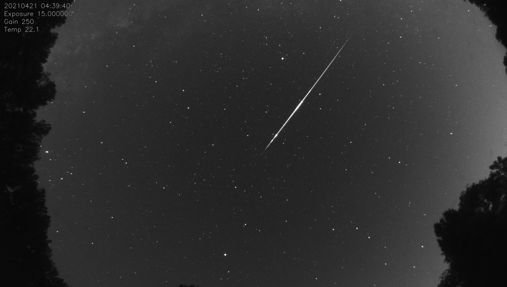

# Indi Allsky
indi-allsky is software used to manage a Linux-based All Sky Camera using the INDI framework.  Theoretically, any INDI supported CCD/CMOS camera should be usable.



## Features
* Multiple camera vendor support
    * ZWO
    * Svbony
    * QHY
    * Altair
    * ToupTek
    * Player One Astronomy
    * Raspberry Pi HQ Camera
    * Canon DSLRs
    * Generic web cameras
    * More to come
* Dark frames to remove hot pixels
* Timelapse video generation
* Network file transfers - Upload images and videos to remote site
* Keograms
* Star Trails
* Images display local hour angle of sun and moon
* Moon mode - reduced gain when the moon is overhead
* Remote INDI server operation - operate camera remotely over the network
* Pseudo-Sky Quality Meter - Use your all sky camera to measure sky brightness/quality
* SQLite database stores image metadata

## Requirements
* A computer running a modern Linux distribution, such as a Raspberry Pi
    * Multicore is recommended
        * ARM
        * x86_64
    * 1GB RAM minimum
        * 512MB is adequate for image acquisition, but not enough to generate timelapse videos with ffmpeg
    * 64GB of storage minimum to store 2 months of videos and 30 days of JPEG images.
    * (Optional) Internet connectivity for image uploading
    * Note: Raspbian 11 (bullseye) support is not yet available for Astroberry
* An INDI supported camera
    * CPU architecture support varies between camera manufacturers

MacOS support is theoretically possible, but not tested.  Not all INDI cameras have Mac firmwares available.

## Installation
1. Install git
```
apt-get install git
```
1. Clone the indi-allsky git repository
```
git clone https://github.com/aaronwmorris/indi-allsky.git
```
1. Navigate to the indi-allky sub-directory
```
cd indi-allsky.git
```
1. Run setup.sh to install the relevant software
```
./setup.sh
```
 * Note:  You may be prompted for a password for sudo
1. Start the software
```
systemctl --user start indiserver
systemctl --user start indi-allsky
```
1. Login to the indi-allsky web application
https://raspberrypi/
 * Note: The web server is configured with a self-signed certificate.

### Manual operation
1. Stop indi-allsky service
```
systemctl --user stop indi-allsky
```
1. Activate the indi-allsky python virtual environment
```
source virtualenv/indi-allsky/bin/activate
```
1. Start indi-allsky
```
./allsky.py run
```

### Logs
* When indi-allsky is run from the command line, logs are sent to STDERR by default.
* When the indi-allsky service is started, logs are sent to syslog via facility local6.  Logs are stored in /var/log/indi-allsky/indi-allsky.log and rotated daily.


### Dark frames
1. Stop indi-allsky service (above)
1. Activate the indi-allsky python virtual environment (above)
1. Start indi-allsky with darks option
```
./allsky.py darks
```

* Darks will be generated in 5 second increments (offset +1) for the configured gain and binmode for night, moonmode, and day frames.
* This operation can take a while depending on your maximum exposure.
    * 15 second maximum exposure:  ~2 minutes
    * 60 second maximum exposure:  ~15 minutes

## Keograms
Keograms are a visual representation of the entire timelapse video in a single frame.  Every image is rotated so that the vertical aligns to the meridian and then the center-vertical column is extraced from each frame and compiled into the keogram.  The rotation parameter in the config is KEOGRAM_ANGLE

Below you can see perodic clouds passed over between 8-9pm and again between 4-5am.  If you look closely enough, you can see the Pleiades star cluster and the Orion constellation as it passed through the meridian in this example keogram.


Note: The horizontal lines are just hot pixels that were subtracted by the dark frame.

## Star Trails
Star trail images stack the stars from each frame to show their progression across the sky.


## Web Interface

The indi-allsky web interface is built on the Flask MVC framework.  It is designed to be a dashboard for your sky.  Included is the ability to fully manage the camera configuration without having to manually edit from the command line.

The default credentials for accessing the web interface are user `admin` and password `secret`

### Home Page


### Charts
Early evening, the sun was still going down, but a cloud passed by, increasing the average brightness and lowering the star count.


A large cloud passed over significantly increasing the brightness of the sky and blocking out almost all of the stars.


### Image viewer
Historical images can be browsed.  (A small satellite flare.)


### Timelapse viewer
Historical Star trails and Keograms.  The Keogram image is linked directly to the timelapse video for the night.


### System Info


## Database

All media generated are logged in a local SQLite database stored in /var/lib/indi-allsky/indi-allsky.sqlite  This database is used as the source of images for timelapse and keogram generation, as well as, for displaying images via the web interfaces.

The database is managed via the python modules SQLAlchemy and alembic to provide migrations (schema upgrades) automatically in the setup.sh script.


## Performance

indi-allsky itself is written in python, but python is just the glue between the different libraries, most of which are C based which makes indi-allsky extremely fast.  A 1920 x 1080 image can be dark frame calibrated, debayered, histogram processed, text applied, and compressed to a JPG in less than 0.5 seconds on Raspberry Pi 3 class hardware.  PNG processing is a little more taxing, but usually only takes a few seconds.

ffmpeg video processing is considerably more expensive.  A 2 minute x264 encoded video compiled from 3,000 frames requires ~20 minutes on Raspberry Pi 3 (4 core) hardware.  Encoding takes place in a separate process from image aqcuisition and image processing and is run at the lowest CPU priority so image acquision is never impacted.

## Software Dependencies

| Function          | Software      | URL |
| ----------------- | ------------- | --- |
| Camera interface  | INDI          | https://indilib.org/ |
|                   | pyindi-client | https://github.com/indilib/pyindi-client |
| Image processing  | OpenCV        | https://opencv.org/ |
|                   | opencv-python | https://github.com/opencv/opencv-python |
|                   | astropy       | https://www.astropy.org/ |
|                   | numpy         | https://numpy.org/ |
| Video processing  | ffmpeg        | https://www.ffmpeg.org/ |
| Astrometry        | pyephem       | https://rhodesmill.org/pyephem/ |
| File transfer     | pycurl        | http://pycurl.io/ |
|                   | paramiko      | http://www.paramiko.org/ |
| Database          | SQLite        | https://www.sqlite.org/ |
|                   | SQLAlchemy    | https://www.sqlalchemy.org/ |
|                   | alembic       | https://alembic.sqlalchemy.org/ |
| Web interface     | Flask         | https://flask.palletsprojects.com/ |
|                   | WTForms       | https://wtforms.readthedocs.io/ |
|                   | Gunicorn      | https://gunicorn.org/ |
|                   | Apache        | https://httpd.apache.org/ |

## Architecture

indi-allsky utilizes python's multiprocessing library to enable parallelizing tasks so that image processing does not interfere with image aquisition, etc.


## Configuration

All configuration is read from /etc/indi-allsky/config.json .  You can find configuration examples in the examples/ folder.

| Setting             | Default     | Description |
| ------------------- | ----------- | ----------- |
| INDI_SERVER         | localhost   | (str) Hostname for INDI server |
| INDI_PORT           | 7624        | (int) Port for INDI server |
| CCD_CONFIG          |             | (dict) Indi configuration parameters for CCD |
| > NIGHT > GAIN      |             | (int) Gain/ISO for night time |
| > NIGHT > BINNING   |             | (int) Bin mode for night time |
| > MOONMODE > GAIN    |            | (int) Gain/ISO for moon mode|
| > MOONMODE > BINNING |            | (int) Bin mode for moon mode|
| > DAY > GAIN        |             | (int) Gain/ISO for day time |
| > DAY > BINNING     |             | (int) Bin mode for day time |
| INDI_CONFIG_DEFAULTS |            | (dict) Indi default configuration parameters |
| > PROPERTIES        |             | (dict) Indi properties |
| > SWITCHES          |             | (dict) Indi switches |
| CCD_EXPOSURE_MAX    | 15          | (seconds) Maximum exposure time |
| CCD_EXPOSURE_MIN    | Auto detected | (seconds) Minimum exposure time |
| CCD_EXPOSURE_DEF    | CCD_EXPOSURE_MIN | (seconds) Default/starting exposure |
| EXPOSURE_PERIOD     | 15          | (seconds) Time between beginning of each exposure |
| AUTO_WB             | true        | (bool) Automatic white balance adjustment |
| TARGET_ADU          | varies      | (int) Target image brightness to calculate exposure time |
| TARGET_ADU_DEV      | 10          | (int) Deviation +/- from target ADU to recalculate exposure time |
| ADU_ROI             | []          | (array) Region of interest to calculate ADU (x1, y1, x2, y2) - Note: ROI calculated using bin 1 coordinates, scaled for bin value |
| DETECT_STARS        | true        | (bool) Enable star detection |
| SQM_ROI             | []          | (array) Region of interest for SQM and Star detection |
| LOCATION_LATITUDE   |             | (float) Your latitude for astrometric calculations |
| LOCATION_LONGITUDE  |             | (float) Your longitude for astrometric calculations |
| DAYTIME_CAPTURE     | false       | (bool) Perform day time image capture |
| DAYTIME_TIMELAPSE   | false       | (bool) Generate timelapse from day time images |
| DAYTIME_CONTRAST_ENHANCE | false  | (bool) Perform CLAHE contrast enhancement on day time images |
| NIGHT_CONTRAST_ENHANCE   | false  | (bool) Perform CLAHE contrast enhancement on night time images |
| NIGHT_SUN_ALT_DEG   | -6          | (degrees) Altitude of Sun to calculate beginning and end of night |
| NIGHT_MOONMODE_ALT_DEG   | 0      | (degrees) Altitude of Moon to enable night time "moon mode" |
| NIGHT_MOONMODE_PHASE     | 33     | (percent) Minimum illumination of Moon to enable night time "moon mode" |
| KEOGRAM_ANGLE       | 0           | (float) Angle of image rotation for keogram generation |
| KEOGRAM_H_SCALE     | 100         | (int) Horizontal scaling of keograms |
| KEOGRAM_V_SCALE     | 33          | (int) Vertical scaling of keograms |
| KEOGRAM_LABEL       | true        | (bool) Label keogram timeline |
| STARTRAILS_MAX_ADU  | 50          | (int) Max ADU/brightness of image to be included in star trails |
| STARTRAILS_MASK_THOLD    | 190    | (int) Minimum threshold for star mask generation for star trails |
| STARTRAILS_PIXEL_THOLD   | 1.0    | (float) Cutoff percentage of pixels in mask to eliminate images from star trails |
| IMAGE_FILE_TYPE     | jpg         | (string) Image output type, jpg or png |
| IMAGE_FILE_COMPRESSION   |        | (dict) Default compression values for image types |
| IMAGE_FOLDER        |             | (string) Base folder to save images |
| IMAGE_DEBAYER       | Auto detected | (string) OpenCV debayering algorithm |
| IMAGE_GRAYSCALE     | false       | Convert image to grayscale |
| IMAGE_FLIP_V        | false       | (bool) Flip images vertically |
| IMAGE_FLIP_H        | false       | (bool) Flip images horizontally |
| IMAGE_SCALE         | 100         | (percent) Image scaling factor |
| IMAGE_CROP_ROI      | []          | (array) Region of interest to crop image (x1, y1, x2, y2) |
| IMAGE_SAVE_RAW      | false       | (bool) Save raw image file |
| IMAGE_EXPIRE_DAYS   | 30          | (days) Number of days to keep original images before deleting |
| FFMPEG_FRAMERATE    | 25          | (fps) Target frames per second for timelapse videos |
| FFMPEG_BITRATE      | 2500k       | (kilobytes) Target data rate for timelapse video compression |
| TEXT_PROPERTIES     |             | (dict) Default text properties (font, size, etc) |
| > FONT_FACE         |             | (str) OpenCV font name |
| > FONT_HEIGHT       | 30          | (pixels) Font height |
| > FONT_X            | 15          | (pixels) Font X offset |
| > FONT_Y            | 30          | (pixels) Font Y offset |
| > FONT_COLOR        | [200, 200, 200] | (array) R, G, B font color values |
| > FONT_AA           | LINE_AA     | (str) OpenCV antialiasing algorighm |
| > FONT_SCALE        | 0.8         | (float) Font scaling factor |
| > FONT_THICKNESS    | 1           | (int) Font weight |
| > FONT_OUTLINE      | true        | (bool) Enable black outline of text |
| ORB_PROPERTIES      |             | (dict) Sun and moon org drawing properties |
| > RADIUS            | 9           | (pixels) Radius of orbs |
| > SUN_COLOR         | [0, 255, 255]   | (array) R, G, B Color of sun orb |
| > MOON_COLOR        | [255, 255, 255] | (array) R, G, B Color of moon orb |
| FILETRANSFER        |             | (dict) File tranfer configuration |
| > CLASSNAME         |             | (str) File transfer class |
| > HOST              |             | (str) Hostname for file transfer |
| > PORT              | 0           | (int) Port for file transfer (null for protocol default) |
| > USERNAME          |             | (str) Username for file tranfer |
| > PASSWORD          |             | (str) Password for file tranfer |
| > TIMEOUT           | 5.0         | (float) Timeout for file transfer before failing |
| > REMOTE_IMAGE_NAME | latest.{0}  | (str) Python template for remote file name of latest image, extension is automatically selected from IMAGE_FILE_TYPE |
| REMOTE_IMAGE_FOLDER        |      | (str) Remote folder to upload latest image |
| REMOTE_VIDEO_FOLDER        |      | (str) Remote folder to upload time lapse videos |
| REMOTE_KEOGRAM_FOLDER      |      | (str) Remote folder to upload keograms |
| REMOTE_STARTRAIL_FOLDER    |      | (str) Remote folder to upload star trails |
| REMOTE_ENDOFNIGHT_FOLDER   |      | (str) Remote folder to upload Allsky EndOfNight data |
| UPLOAD_IMAGE        | 0           | (int) Upload latest image every X frames |
| UPLOAD_VIDEO        | false       | (bool) Enable timelapse video uploads |
| UPLOAD_KEOGRAM      | false       | (bool) Enable keogram uploads |
| UPLOAD_STARTRAIL    | false       | (bool) Enable star trail upload |
| UPLOAD_ENDOFNIGHT   | false       | (bool) Enable EndOfNight data upload.  This is the data.json file for https://github.com/thomasjacquin/allsky-website |

### Moon mode

This is a special night time operating mode intended to reduce gain when the moon is more illuminated and above the horizon


## Tested Hardware

I have extensively tested the ZWO ASI290MM and the Svbony SV305.  3-4 weeks of steady runtime with no intervention are common.  The only reason I restart my cameras are code updates (or power failures).

The hardware below has at least been plugged in and tested for correct detection and CFA decoding.

| Vendor   | Model               | Rating | Notes |
| -------- | ------------------- | ------ | ----- |
| Svbony   | SV305               | B      | ~20% of frames require double the configured exposure time to complete. Likely a firmware bug. |
| ZWO      | ASI290MM            | A      |       |
| ZWO      | ASI178MM            | A      |       |
| ZWO      | ASI178MC            | A      |       |
| ZWO      | ASI071MC Pro        | A      |       |
| ZWO      | ASI183MM Pro        | A      |       |
| ZWO      | ASI183MC Pro        | A      |       |
| QHY      | QHY5LII-M           | A      |       |
| Altair   | GPCAM2 290M         | A      |       |
| Touptek  | G-1200-KMB          | A      |       |
| Player One   | Mars-C          | A      |       |
| Raspberry Pi | HQ Camera       | C      | Requires 7+ second throw away exposure to enable long exposures.  https://github.com/indilib/indi-3rdparty/issues/271 <br /> Taking variable length exposures, especially when going below 6 seconds when taking long exposures, is not stable. |
| Canon    | 550D (Rebel T2i)    | A      | Camera resolution and pixel size have to be manually defined in config |
| Canon    | 1300D (Rebel T6)    | A      | Camera resolution and pixel size have to be manually defined in config |
| Generic  | indi_webcam_ccd     | D      | No gain controls.  Little control over image quality. |
| indi     | indi_simulator_ccd  |        | CCD Simulator.  Install GSC to generate sample images. |

If you have an INDI supported camera from a vendor not listed, open an enhancement request and I can work with you to support the camera.


## Gotchas
Common problems you might run into.

* The indi-allsky python processes consume ~500MB of RAM.
    * 1K (1920x1080) x264 encoding with ffmpeg requires an additional ~500MB of RAM.  1GB of RAM should be the bare minimum system memory.  You should also have 100-200MB of additional swap space to prevent running out of memory during encoding.
    * 4K (3840x2160) x264 encoding requires an additional 2+GB of RAM.  4GB of RAM should be the minimum system memory.
* The x264 codec is has a maximum frame size of 4096×2304.  If your camera generates images larger than this, you will need to scale the frames or use the Region of Interest (RoI) options to reduce the frame size.
    * The RaspberryPi HQ camera has a bin1 image size of 4056x3040.  Setting IMAGE_SCALE to 75 in the config results in a image size of 3042x2280.  Alternatively, you can center crop the image using IMAGE_CROP_ROI set to [0, 368, 4056, 2672] for an image size of 4056×2304.


## File Transfer

indi-allsky supports several file transfer methods.  Additional file transfer methods are planned such as direct to YouTube uploads.

| Protocol | Class Name    | Port | Description |
| -------- | ------------- | ---- | ----------- |
| ftp      | pycurl_ftp    | 21   | FTP via pycurl |
|          | python_ftp    | 21   | FTP via ftplib |
| ftpes    | pycurl_ftpes  | 21   | FTPS (explicit) via pycurl |
|          | python_ftpes  | 21   | FTPS (explicit) via ftplib |
| ftps     | pycurl_ftps   | 990  | FTPS (implicit) via pycurl |
| sftp     | pycurl_sftp   | 22   | SFTP via pycurl |
|          | paramiko_sftp | 22   | SFTP via paramiko |

## To Do

* Additional camera vendor support

## Acknowledgements

* [Thomas Jacquin](https://github.com/thomasjacquin) - indi-allsky is heavily inspired by his [allsky](https://github.com/thomasjacquin/allsky) software.
* [Marco Gulino](https://github.com/GuLinux) - His examples from [indi-lite-tools](https://github.com/GuLinux/indi-lite-tools) were key to understanding how to work with pyindi-client

