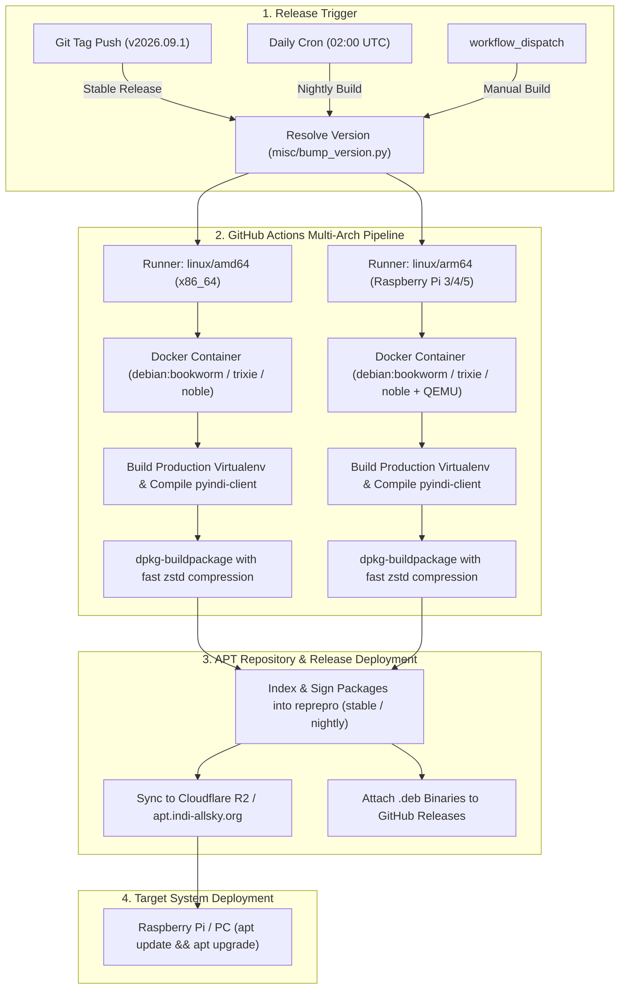

# Release and Debian Package Deployment Guide

This document outlines the complete release lifecycle for maintainers, the **CI/CD build and APT repository pipeline**, and **target system installation instructions**.

---

## 1. How to Cut a New Release (Maintainer Guide)

To cut a new official release (e.g. `2026.09.1`), run the following commands from the repository root:

```bash
# 1. Bump the version across all codebase manifests (indi_allsky/version.py, package.json, base.html, debian/changelog)
npm run version:bump -- 2026.09.1

# 2. Stage and commit the bumped version
git add -u
git commit -m "Release v2026.09.1"

# 3. Create an annotated git tag
git tag -a v2026.09.1 -m "Release v2026.09.1"

# 4. Push branch and tag to trigger the automated CI/CD release workflow
git push origin main --tags
```

---

## 2. Automated CI/CD & APT Repository Architecture

Pushing an official git tag (`v*` or `indi_v*`) triggers `.github/workflows/package-deb.yml`:



### Channels:
- **`stable`**: Indexed when an official version tag (`v*` or `indi_v*`) is pushed.
- **`nightly`**: Built continuously from the latest `main` branch commits and nightly scheduled runs.

---

## 3. End-User Installation via APT Repository

Users can install and maintain `indi-allsky` on Raspberry Pi OS, Debian, and Ubuntu directly via `apt.indi-allsky.org`.

### Step 1: Add the GPG Keyring
```bash
sudo mkdir -p /etc/apt/keyrings
curl -fsSL https://apt.indi-allsky.org/key.gpg | \
  sudo gpg --dearmor -o /etc/apt/keyrings/indi-allsky.gpg
sudo chmod a+r /etc/apt/keyrings/indi-allsky.gpg
```

### Step 2: Add Repository Source (DEB822 format)

#### Stable Channel (Recommended for Production)
```bash
sudo tee /etc/apt/sources.list.d/indi-allsky.sources <<EOF
Types: deb
URIs: https://apt.indi-allsky.org
Suites: $(lsb_release -cs)
Components: stable
Architectures: $(dpkg --print-architecture)
Signed-By: /etc/apt/keyrings/indi-allsky.gpg
EOF
```

#### Nightly Channel (Bleeding-Edge Development)
```bash
sudo tee /etc/apt/sources.list.d/indi-allsky-nightly.sources <<EOF
Types: deb
URIs: https://apt.indi-allsky.org
Suites: $(lsb_release -cs)
Components: nightly
Architectures: $(dpkg --print-architecture)
Signed-By: /etc/apt/keyrings/indi-allsky.gpg
EOF
```

### Step 3: Install
```bash
sudo apt update
sudo apt install -y indi-allsky
```

---

## 4. Headless / Automated Zero-Touch Deployment

For automated provisioning (Ansible, cloud-init, unattended scripts), Debconf prompts can be pre-seeded before running `apt install`:

```bash
# Pre-seed Debconf configuration
sudo debconf-set-selections <<EOF
indi-allsky indi-allsky/camera_interface select indi
indi-allsky indi-allsky/ccd_driver select indi_asi_ccd
indi-allsky indi-allsky/http_port string 80
indi-allsky indi-allsky/https_port string 443
indi-allsky indi-allsky/web_user string admin
indi-allsky indi-allsky/web_pass password secretpassword
indi-allsky indi-allsky/web_pass_confirm password secretpassword
indi-allsky indi-allsky/latitude string 40.7128
indi-allsky indi-allsky/longitude string -74.0060
indi-allsky indi-allsky/timezone string America/New_York
indi-allsky indi-allsky/oidc_enable boolean false
EOF

# Unattended non-interactive install
sudo DEBIAN_FRONTEND=noninteractive apt install -y indi-allsky
```

---

## 5. Service Lifecycle & Management

The Debian package installs and manages native systemd user/system services:

* `gunicorn-indi-allsky.socket` / `gunicorn-indi-allsky.service`: Web UI dashboard server.
* `indi-allsky.service`: Camera capture, keogram, startrail, and processing daemon.
* `indiserver.service`: Local INDI driver server (activated when INDI camera/sensors are configured).

### Useful Service Commands:
```bash
# Control services via indi-allsky-ctl utility
indi-allsky-ctl status
indi-allsky-ctl restart
indi-allsky-ctl stop

# View system logs
journalctl -u indi-allsky.service -f
journalctl -u gunicorn-indi-allsky.service -f
```

---

## 6. Upgrades & Uninstallation

* **Upgrades**:
  ```bash
  sudo apt update && sudo apt upgrade -y
  ```
  * Upgrades virtualenv packages and binaries in seconds.
  * Preserves user customizations in `/etc/indi-allsky/flask.json`.
  * Runs database migrations and reloads services automatically.

* **Purge / Clean Removal**:
  ```bash
  sudo apt purge indi-allsky indi-allsky-web
  ```
  * Removes all configuration files, databases, logs, and system users.

