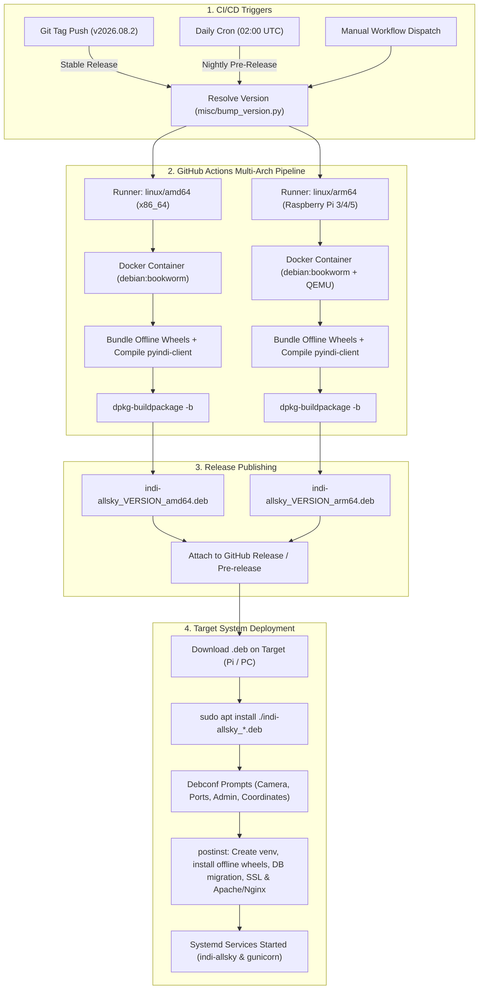

# Debian Package Deployment Workflow

This document outlines the end-to-end deployment workflow for `indi-allsky`, covering the **CI/CD build pipeline**, **artifact release lifecycle**, and **target system installation & runtime operations**.

---

## 1. High-Level Architecture



---

## 2. Triggering Package Builds

The `.github/workflows/package-deb.yml` workflow builds packages automatically under three scenarios:

1. **Official Releases**:
   ```bash
   git tag v2026.08.2
   git push origin v2026.08.2
   ```
   * Generates a **Stable Release** with package version `2026.08.2-1`.
2. **Nightly Builds**:
   * Runs automatically once a day at `02:00 UTC` via GitHub Actions cron.
   * Generates a **Nightly Pre-Release** tagged with `~nightly.YYYYMMDD.HHMM`.
3. **Manual Run**:
   * Triggered on demand via the GitHub Actions `workflow_dispatch` interface.

---

## 3. Multi-Architecture Build Matrix (CI)

1. **Version Resolution**: `misc/bump_version.py` dynamically synchronizes version numbers across `indi_allsky/version.py`, `package.json`, `base.html`, and prepends a Debian changelog entry.
2. **Isolated Container Compilation**:
   * For each architecture (`amd64` and `arm64`), a native `debian:bookworm` container is spawned.
   * `arm64` builds execute cleanly on standard GitHub `ubuntu-latest` x86 runners via QEMU emulation (`docker/setup-qemu-action`).
3. **Full Offline Wheel Cache Packaging**:
   * Compiles SWIG/C++ bindings for `pyindi-client`.
   * Pre-downloads all dependencies from `requirements/requirements_latest.txt` into `debian/wheels/`.
   * Packages the entire wheel cache into an architecture-native `.deb` file.

---

## 4. Target System Installation & Deployment

### A. Interactive Installation (Default)

Users download and install the package using standard `apt`:

```bash
# 1. Download matching package for your architecture
wget https://github.com/aaronwmorris/indi-allsky/releases/download/v2026.08.2/indi-allsky_2026.08.2-1_arm64.deb

# 2. Install (apt automatically resolves system dependencies)
sudo apt update
sudo apt install ./indi-allsky_2026.08.2-1_arm64.deb
```

During installation, Debconf presents interactive terminal prompts to configure:
* **Camera interface & driver** (`indi`, `libcamera`, `simulator`, `mqtt`)
* **HTTP / HTTPS / INDI ports** (defaults: `80`, `443`, `7624`)
* **Initial admin credentials & email**
* **Observatory location & timezone**
* **OIDC Single Sign-On** (optional Client ID, Secret, and Discovery URL)

---

### B. Headless / Automated Zero-Touch Deployment

For automated provisioning (Ansible, cloud-init, unattended scripts), configuration choices can be pre-seeded into Debconf before running `apt install`:

```bash
# Pre-seed Debconf configuration
sudo debconf-set-selections <<EOF
indi-allsky indi-allsky/camera_interface select indi
indi-allsky indi-allsky/ccd_driver select indi_asi_ccd
indi-allsky indi-allsky/http_port string 80
indi-allsky indi-allsky/https_port string 443
indi-allsky indi-allsky/web_user string admin
indi-allsky indi-allsky/web_pass password secretpassword
indi-allsky indi-allsky/web_pass_confirm password secretpassword
indi-allsky indi-allsky/latitude string 40.7128
indi-allsky indi-allsky/longitude string -74.0060
indi-allsky indi-allsky/timezone string America/New_York
indi-allsky indi-allsky/oidc_enable boolean false
EOF

# Unattended non-interactive install
sudo DEBIAN_FRONTEND=noninteractive apt install -y ./indi-allsky_2026.08.2-1_arm64.deb
```

---

## 5. Post-Installation Lifecycle (`postinst`)

When `postinst` runs on the host:

1. **Security Isolation**: Creates the unprivileged `indi-allsky` system user & group, assigns hardware permissions (`dialout`, `video`, `plugdev`, `gpio`, `i2c`, `spi`, `adm`).
2. **Offline Python Environment**: Initializes `/var/lib/indi-allsky/venv` and installs the bundled wheel cache with `--no-index` (zero network calls).
3. **Database Migration**: Creates `/var/lib/indi-allsky/indi-allsky.sqlite`, runs schema migrations (`config.py db_upgrade`), and adds the initial admin user.
4. **Reverse Proxy Setup**: Configures **Apache2** (or **Nginx**), generates self-signed SSL certificates (`/etc/apache2/ssl/` or `/etc/nginx/ssl/`), and enables WebSocket proxying.
5. **Service Management**: Systemd services are automatically registered and started:
   * `gunicorn-indi-allsky.socket` (Flask web application socket)
   * `indi-allsky.service` (Camera capture and image processing daemon)
   * `indiserver.service` (Conditionally enabled if using INDI drivers)
6. **Credential Sanitization**: Resets plaintext credentials in the Debconf cache via `db_reset`.

---

## 6. Package Upgrades & Uninstallation

* **Reclaiming disk space after installation**:
  ```bash
  sudo apt remove indi-allsky-wheels
  ```
  * Safely removes the ~200MB+ pre-compiled offline Python wheel cache from `/usr/share/indi-allsky/wheels/` while keeping the provisioned virtualenv and all camera services fully operational.

* **Upgrading to a newer version**:
  ```bash
  sudo apt install ./indi-allsky_2026.09.1-1_arm64.deb
  ```
  * Performs an automated pre-migration SQLite backup to `/var/lib/indi-allsky/backup/`.
  * Preserves user customizations in `/etc/indi-allsky/flask.json` using `jq` config merging.
  * Runs database migrations and restarts systemd services automatically.

* **Purging the package**:
  ```bash
  sudo apt purge indi-allsky indi-allsky-wheels
  ```
  * Removes all created configuration files, SSL certificates, database files, logs, and cleans up the system user.

