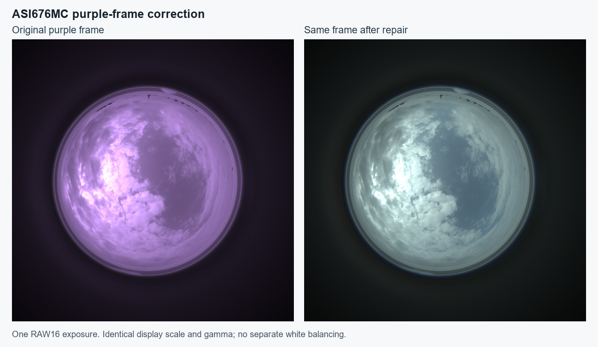

# Overview
Some ZWO ASI676MC cameras occasionally produce an image with a strong purple
or magenta cast between otherwise normal images. indi-allsky can detect and
exclude these frames, or repair them automatically after calibration while
continuing to capture in RAW16.

This guide covers the built-in **Fix ASI676MC purple frames** tool. For the
correction algorithm, all settings, and detailed calibration requirements, see
[ASI676MC Purple Frame Repair Details](ASI676MC-Purple-Frame-Repair-Details).

**RGB24 workaround:** [Jump directly to the original instructions](#older-rgb24-workaround).
The built-in repair described below supports ASI676MC only; it does not support
ASI224MC.

## Purple Images

The failure affects individual frames. A persistent colour cast on every image
is not enough to identify this problem. Leave purple-frame handling off unless
your ASI676MC actually produces the intermittent failure.



*The same original RAW16 exposure before and after correction with the current
repair implementation and its default repair values. Both panels use the same
display scale and gamma, without separate white balancing. This illustrates
the correction; calibrate using your own camera's frames before enabling it.*

The repair corrects an observed one-row displacement and colour-channel
imbalance in the raw image, and estimates green values lost in clipped bright
areas. It does not fix the underlying camera or driver cause. Reconstructed
highlights are estimates, so a repaired frame should not be treated as an
untouched measurement. The original investigation is in
[issue #2007](https://github.com/aaronwmorris/indi-allsky/issues/2007).

## Before you begin

- Use a local **ASI676MC**, capturing **RAW16**, with **RGGB** Bayer pattern,
  **1x1 binning**, and zero Bayer offsets. Other formats and layouts are not
  supported by this repair.
- Use an account that can save configuration settings. With normal login
  enabled, this means an administrator.
- If your installation does not have these controls, follow
  [Updating indi-allsky](Updating-indi-allsky).
- This tool is **ASI676MC only**. Similar-looking problems on an ASI224MC or
  another camera are outside its supported scope.

## Collect calibration frames

1. Open **Config > Image** and find **ASI676MC purple-frame handling**.
2. Turn on **Enable ASI676MC purple-frame handling**.
3. Leave **Detect and exclude only** on. This keeps detected purple frames
   unchanged and excludes them from standard timelapses while you collect
   calibration evidence.
4. Turn on **Save purple and following normal FITS for calibration**. This
   saves the original purple FITS and its next compatible frame without
   requiring every image to be saved as FITS.
5. Optionally turn on **Also save the preceding normal FITS**. A normal frame
   on both sides of the purple frame gives better evidence. This option uses
   about one extra FITS frame of memory.
6. Save the configuration and let the camera collect more frames.

Use **daylight captures with visible bright areas**, at **at least two
different exposure settings**. The tool needs at least **seven purple frames**
and **seven distinct compatible normal references**. For each purple frame,
include the normal frame immediately before or after it, preferably both,
with matching capture settings. Bright areas are needed to calibrate highlight
reconstruction; seven purple events alone do not guarantee a successful result.

Standard FITS saving can stay off if you do not need it for another purpose.
Diagnostic files follow normal FITS retention, so allow enough time and disk
space to retain the evidence until calibration finishes.

If purple frames are not being detected and diagnostic saving misses them,
temporarily keep **Detect and exclude only** on and set standard FITS saving
to **Every Image**. This lets the tool inspect failures outside the current
detection thresholds. Occasional FITS saving can miss a random event.

## Run calibration

Open **Tools > Fix ASI676MC purple frames**. Select the ASI676MC if the page
offers a camera selector.

### Use saved FITS

Choose **Use saved FITS** to search the camera's retained FITS files. Leave
the target at **20 purple-frame groups** for a first attempt. The tool finds
suitable purple frames and nearby normal references automatically and reports
missing or unsuitable evidence. Seven usable groups is the minimum.

Wait for analysis to finish. The progress view shows the current stage, and
you can cancel if needed. Searching and calibration leave the original saved
FITS files untouched.

### Upload a FITS collection

Use **Upload a FITS collection** when you have collected the files elsewhere.
Select the purple and adjacent normal frames together: **14 to 80 uncompressed
`.fit`, `.fits`, or `.fts` files**, up to **256 MiB per file** and **2 GiB in
total**. The same evidence requirements apply. Fourteen arbitrary files are
not enough; the collection needs matching purple and normal captures.

Upload copies are private and deleted after analysis. Your original files
remain in their original location.

## Understand the result

Analysis does not change your settings automatically. Use **Download details**
to keep a report of the result and any warnings.

| Result | What to do |
| --- | --- |
| **Full calibration** | Review the matched frames, exposure coverage, and warnings. If the evidence is suitable, choose **Save calibration values**, then enable repair as described below. |
| **Detection settings need adjustment** | This is a preliminary result, not a repair calibration. Check that the likely-purple files show the actual camera failure, using the previews when available and the filenames and capture times. Confirm this, choose **Save detection settings**, then **Start over** and run calibration again. Keep **Detect and exclude only** on. |
| **Analysis failed** | Read the retained explanation, correct the problem or collect more suitable frames, then choose **Try again**. No calibration settings were applied. |

If the tool recommends more complete normal/purple/normal groups or more varied
evidence, collect those before relying on the result. Do not change thresholds
just to make an unsuccessful analysis pass.

## Enable repair and check the results

After saving a suitable full calibration:

1. Return to **Config > Image > ASI676MC purple-frame handling**.
2. Turn **Detect and exclude only** off and save the configuration. Saving
   calibration values alone does not enable repair.
3. Optionally enable **Show purple-frame status in gallery** to review repaired,
   excluded, and failed frames and use the corresponding filters.
4. Check subsequent purple events in the gallery and logs. Return FITS-saving
   options to your preferred long-term settings once you are satisfied.

Repair happens automatically on newly captured frames before normal image
processing. The calibration tool does not repair an existing archive of images
or regenerate old timelapses.

| Frame status | Meaning |
| --- | --- |
| **Normal** | The frame did not match the purple signature and was not changed by this feature. |
| **Excluded** | A purple frame was preserved unchanged in exclusion-only mode and omitted from standard timelapses. |
| **Repaired** | Correction passed validation and the repaired image continued through normal processing. |
| **Validation failed** | Correction could not be validated. The original image was retained and excluded from standard timelapses. Collect its diagnostic FITS group and recalibrate. |
| **Skipped** | The input layout or configuration was unsuitable. Check the explanation in the log or Camera notification. |

Excluded frames and failed repairs are also omitted from stacking history and
automatic exposure control. The feature reports skipped checks and failed
repairs through Camera notifications; successful repairs do not create one.

## Common questions

**Why is the tool missing from Tools?**

Enable purple-frame handling and save Config first. A visible local ASI676MC
must be available, and your account must be able to save settings.

**Why does the search find too few frames?**

The capture settings affect future images. Older originals may never have been
saved or may already have expired. Collect more diagnostic FITS. If detection
misses the purple events, use the every-image FITS fallback described above.

**Can I use FITS saved while repair was already enabled?**

Untouched diagnostic FITS are suitable. Standard FITS from successfully repaired
frames contain the corrected image and cannot serve as purple originals.
**Save FITS Pre-Calibration** refers to dark-frame calibration; purple-frame
handling still runs before that save point.

**Does each camera get its own calibration?**

No. Repair settings are shared across the installation. If you change physical
ASI676MC units, review or recalibrate the shared profile. Selecting a camera in
the tool does not create a separate profile for it.

For upload limits, rejected evidence, save errors, and further explanations,
see the [detailed reference](ASI676MC-Purple-Frame-Repair-Details).

## Older RGB24 workaround

Before the built-in repair was available, this page recommended switching from
RAW16 to RGB24, which was reported to reduce the frequency of purple frames.
That remains historical workaround information for installations that cannot
use the repair. RGB24 is outside the repair tool's supported input formats.

The original [INDI configuration](INDI-custom-config) example was:

```json
{
    "SWITCHES": {
        "CCD_VIDEO_FORMAT": {
            "on": [
                "ASI_IMG_RGB24"
            ],
            "off": [
                "ASI_IMG_RAW16"
            ]
        }
    },
    "PROPERTIES": {},
    "TEXT": {}
}
```
